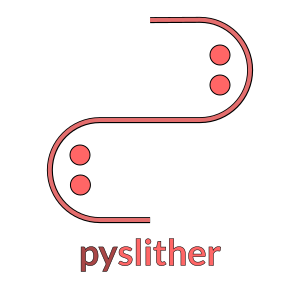
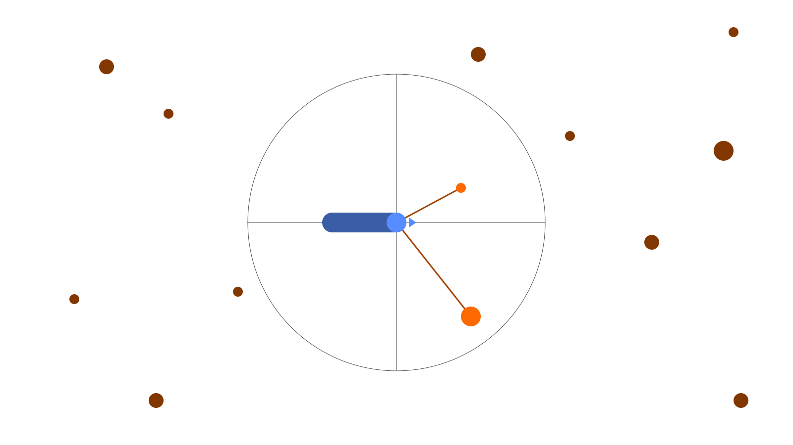

<p align="center">
  
</p>

---
**Pyslither** is a high-performance, fully configurable continuous simulation environment inspired by *Slither.io*, primarily built for **reinforcement learning** research. The core engine is written in C and exposed to Python via a lightweight binding layer, delivering the throughput to run thousands of ticks per second without Python becoming the bottleneck. Observations are returned as standard NumPy arrays through a clean Python API.

Snakes move, boost, collide, eat food, and die - all simulated at a timestep you control. Multiple snakes can coexist in the same environment, supporting single-agent, multi-agent, and self-play training setups.

**Callbacks & event hooks**

The library conveniently exposes callbacks that fire at key simulation events, making them useful for custom metric logging, curriculum scheduling, or reward shaping without modifying core simulation code.

**Library compatibility**

The environment interface follows Gymnasium conventions, so integration with existing training loops requires minimal setup. Observations are plain NumPy arrays, actions use standard formats, and rewards are straightforward to customize. It works with Stable-Baselines3, RLlib, CleanRL, TorchRL, and custom loops written in PyTorch or JAX with no required framework dependencies.

## Installation
```bash
pip install -e ".[example]"
```

## Usage
```python
import pyslither
import numpy as np

sim = pyslither.Simulation()
sim.new_snake(sx, sy, angle)
sim.new_food(fx, fy, value)

for i in range(0, 2048):
    for j, angle in enumerate(sim.snake_angles):
        sim.snake_target_angles[j] = (angle + np.random.random()) % (np.pi * 2)
        sim.snake_boosts[j] = np.random.choice([True, False])

    sim.tick(1.0)

print(f"total snakes = {sim.num_snakes}")
print(f"total food = {sim.num_food}")
```
---
<p align="center">
  
</p>

## License
This project is licensed under the **MIT License** - see [LICENSE](./LICENSE) for details.

## Disclaimer & Copyright
**Pyslither** is an independent research project and is not affiliated with, endorsed by, or associated with *Slither.io* or its developers. The *Slither.io* name and concept are trademarks of their respective owners.
