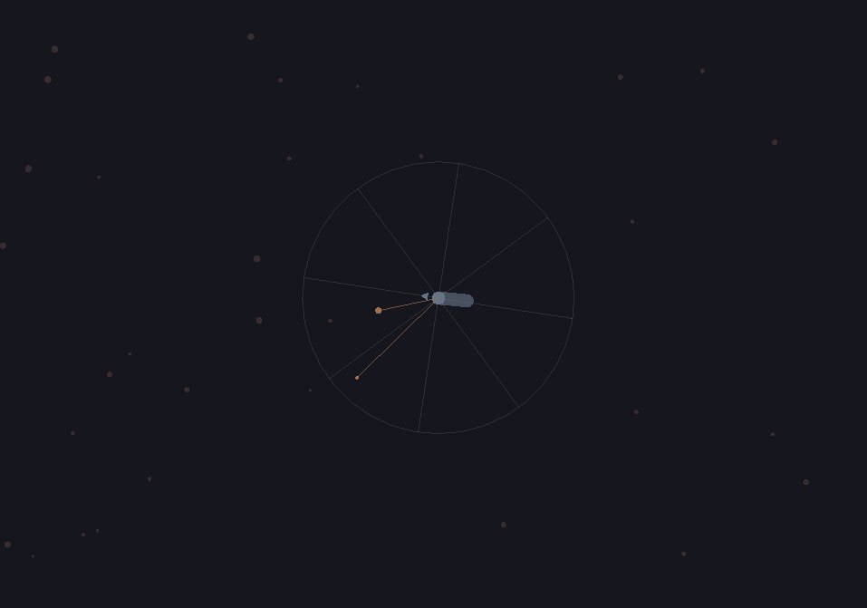

<p align="left">
  
</p>
---
**Pyslither** is a high-performance native-backed simulation environment inspired by *Slither.io*, built primarily for **reinforcement learning** research and education. The core is written in C and conveniently exposed to Python. This means you get **NumPy-compatible** state arrays, a clean Python API, and the performance to run thousands of ticks per second without Python ever becoming the bottleneck.

Snakes move, boost, collide, eat food, and die - all simulated at a timestep you control. Multiple snakes can coexist in the same environment, making **pyslither** suitable for single-agent, multi-agent, and self-play training setups alike.

Take a look at the [examples](./examples) to understand how to integrate with reinforcement learning libraries like **Gymnasium** and **Stable-Baselines3** as well as how to use the API to retrieve needed information from the simulation.

## Installation
```bash
pip install -e ".[examples]"
```

## Usage
```python
import pyslither

sim = pyslither.Simulation()
sim.new_snake(x, y)
sim.new_food(fx, fy, value)

for i in range(0, 2048):
    sim.tick(1.0)

    for dead, angle in zip(sim.get_snake_dead_array(), sim.get_snake_angle_array()):
        if dead:
          continue

        sim.set_snake_target_angle((angle + random.random()) % (numpy.pi * 2))
        sim.set_snake_boost(random.choice([True, False]))

print(f"total snakes = {sum.num_snakes}")
print(f"total food = {sim.num_food}")
```
---


## License
This project is licensed under the **MIT License** - see [LICENSE](./LICENSE) for details.

## Disclaimer & Copyright
**Pyslither** is an independent research project and is not affiliated with, endorsed by, or associated with *Slither.io* or its developers. The *Slither.io* name and concept are trademarks of their respective owners.
